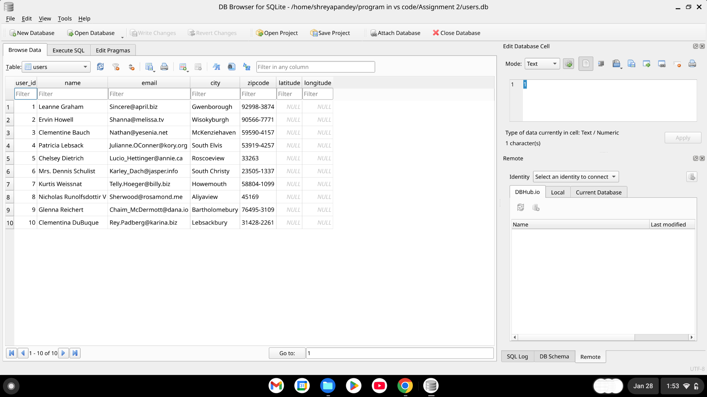

# Assignment 2 — User Data ETL Pipeline (Validation + Storage)

This project is a **Python-based ETL pipeline** that fetches user data from a public REST API, **validates the data**, and stores only **clean, structured records** for further use.

API Source:
https://jsonplaceholder.typicode.com/users
Add image also


The goal of this assignment is to demonstrate:
- API data extraction
- Data validation & cleaning
- Modular Python design
- Pipeline-style execution

---

## 📌 What This Application Does

### 1️⃣ Data Extraction
- Fetches user data from the JSONPlaceholder API
- Uses the `requests` library
- Retrieves structured JSON user objects

```json
{
  "id": 1,
  "name": "Leanne Graham",
  "email": "Sincere@april.biz",
  "city": "Gwenborough"
}
```
Assignment_2/
-├── extract.py          # Fetches data from API
-├── validate.py         # Validation logic
-├── pipeline.py         # End-to-end pipeline runner
-├── data/               # Stored outputs (CSV / DB)
-├── README.md
-├── .gitignore
-└── requirements.txt

-Fetching users from API...
-Total records fetched: 10
-Valid records: 10
-Invalid records: 0
-Data pipeline completed successfully.


